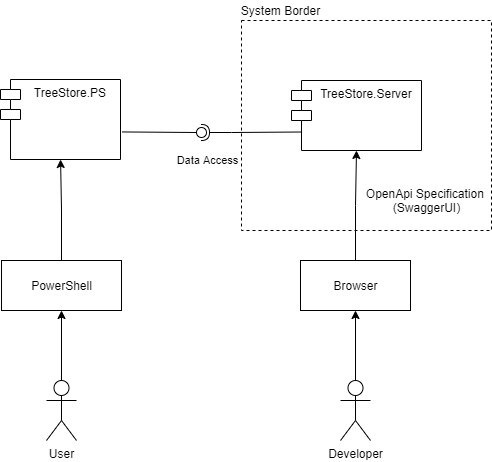

# TreeStore.Server

Provides a backend for accessing TreeStores underlying data structures.
These data structures are:
- Tags
- Entities
- Categories

## System Context

The user of TreeStore will interact with the data structures using a file system provider loaded in a PowerShell instance.
TreeStore.PS (FileSystemProvider) is not part of te development project. PowerShell is external software from Microsoft.

## Solution Strategy

### Quality Goals

1. The data is stored persistently and can be retrieved after a restart of the process.
2. Multiple client must be able to access the data concurrently for reading and writing.
3. A user interaction at the client must not be result in a significant waiting time between action and display of the result.
4. Security 
   1. The server rejects requests from remote clients, only 'localhost' is accepted.
   2. The server accepts requests only from the user that started the server.
 

The first version may ignore remote clients (different machines).
The TreeStore.Server provides access to its data structures as REST interfaces.

## Building Blocks

The [TreeStore.Model](./src/Treestore.Model/readme.md) implements the managed data structures for internal purposes.

Public representations of the data structures and the parameters of the business processes are implemented in
[TreeStore.Model.Abstractions](./src/TreeStore.Model.Abstractions/readme.md).

Access to these data structures from external process is possible using the REST interfaces published by
[TreeStore.Server web service](./src/TreeStoreServer.Host/readme.md)
