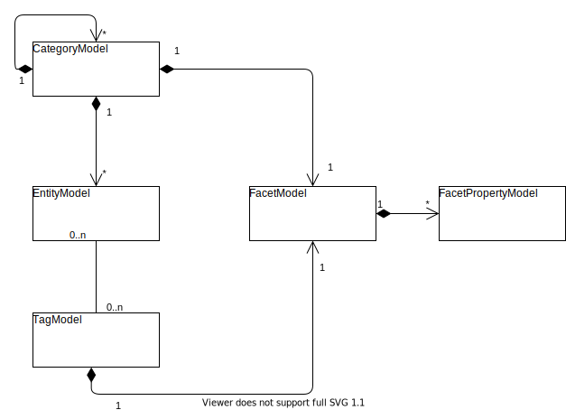

# TreeStore.Model

Provides a modifiable data model of the TreeStore server.
The model is persistence ignorant but provides interface contracts for persistence abstraction.

## Categories

Categories have a single Facet.

## Entities

Entities are assigned to a single Category.
Entities are identified by a name which is unique within its category.
Entities may have assigned multiple Tags.
An entity may hold values for

- all facet properties of the Facets from the category up to the root category
- all facet properties of the Tags assigned to the entity

## Tags

Tags have a single Facet and can be assigned to multiple Entities unrelated to the category of the entity.

## Relationships

**(conceptionally planned but not implemented)**

Relationships connect two entities.
Relationships might be classified as directed or undirected.
Relationships may have assigned multiple tags.